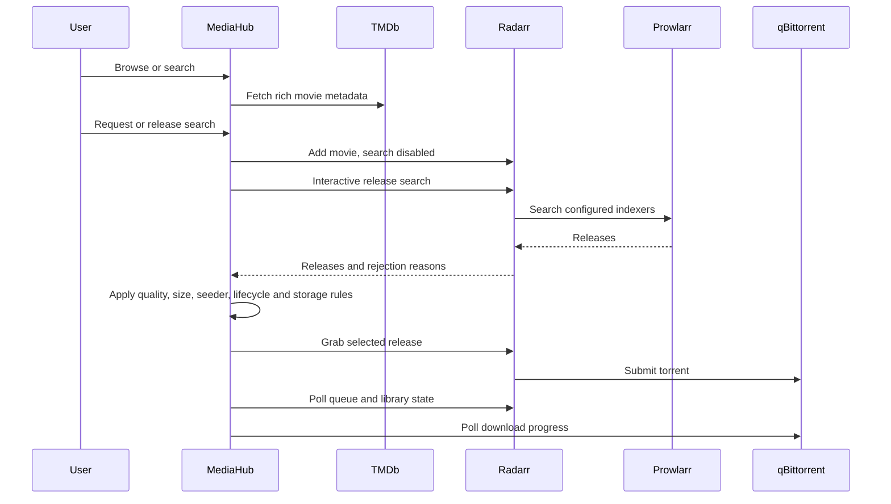

# MediaHub architecture

## Purpose

MediaHub provides a family-friendly Home Assistant Ingress interface for discovering, requesting, and tracking movies and television while keeping automation, download-client credentials, and indexer details hidden from requesters.

## Core components

1. **Home Assistant add-on packaging**
   - Home Assistant Ingress
   - `/media` and `/share` mappings
   - Add-on options for storage and integrations

2. **FastAPI backend**
   - Request lifecycle API
   - Storage-space validation and reservation accounting
   - Duplicate detection
   - Audit events
   - Setup orchestration and credential-safe public settings

3. **Integration boundary**
   - Typed configuration for TMDb, Prowlarr, Radarr, Sonarr, and qBittorrent
   - Vendor-supported health and system endpoints only
   - Bounded timeouts and sanitised failure responses
   - No direct private-tracker access

4. **Movie discovery and request orchestration**
   - TMDb provides catalogue metadata, posters, search, cast, director, ratings metadata, external IDs, certification, regional release dates, and trailers
   - Stable TMDb person IDs are retained for cast and used for actor filmography discovery
   - Radarr owns movie records, interactive release search, release grabbing, and import state
   - Prowlarr owns IPTorrents authentication and translates private-indexer results for Radarr
   - qBittorrent provides torrent progress only; MediaHub does not submit tracker downloads directly
   - Browser-visible release data excludes GUIDs, download URLs, info hashes, cookies, and passkeys
   - Short-lived random release tokens are bound to the requesting user

5. **Rich movie details layer**
   - `rich_details.py` layers above the release-lifecycle application and is the v0.8.0 deployed entrypoint
   - Browse and Downloads use the same frontend movie-detail renderer with a context flag
   - Browse context preserves lifecycle/request controls
   - Downloads context suppresses request/release controls and adds safe request/library metadata
   - Source-labelled ratings are only emitted when supported by available metadata
   - TMDb ratings are displayed directly; IMDb pages are linked from TMDb external IDs without fabricating IMDb scores
   - Rotten Tomatoes is not scraped

6. **Home Assistant discovery**
   - Authenticated Supervisor API access through `SUPERVISOR_TOKEN`
   - Installed app matching by Supervisor slug and metadata
   - Suggested URLs only, with no credential scraping from other apps

7. **Private runtime settings**
   - Home Assistant app options remain the base configuration
   - Wizard settings are stored in `/data/mediahub-settings.json`
   - Atomic replacement and owner-only `0600` permissions
   - Secret values are write-only and never included in setup responses or audit details

8. **SQLite persistence**
   - Requests
   - Append-only audit events
   - Home Assistant-linked users and MediaHub roles
   - Release watches
   - Future media cache, recommendations, and integration state

9. **Separated authentication listeners**
   - Home Assistant Ingress on `8099`, accepting only Supervisor-provided identity
   - External MediaHub on `8100`, accepting only application sessions
   - Shared SQLite users and authorization roles across both listeners
   - No public self-registration or default credentials

## Rich movie metadata flow

Movie detail requests are kept server-side and use TMDb's supported append responses so the browser does not make separate credentialed calls. Normalised metadata includes:

- TMDb movie ID and external IMDb ID when available
- title, synopsis, artwork, runtime, genres, rating and vote count
- Australian release lifecycle information
- Australian certification when supplied by TMDb release records
- director
- primary cast with TMDb person ID, character and profile image
- trailer URL

A selected actor is no longer resolved by name once a TMDb person ID is known. `GET /api/catalog/people/{person_id}/movies` sends that ID to TMDb `discover/movie?with_cast=...`, preventing ambiguity between people with similar names. Existing Browse text search still retains the older actor-name fallback for free-text searches.

`GET /api/downloads/{request_id}/details` verifies the requesting user's access before joining the same movie metadata with a sanitised request/library context. It never returns release GUIDs, torrent hashes, API keys, session data or other credentials.

## Plex boundary

Plex linking is intentionally not implemented in v0.8.0. The repository currently has no Plex URL, authentication token, machine identifier, or library-item matching client. MediaHub therefore does not attempt title-only deep links that could open the wrong movie. A future Plex integration should prefer stable TMDb/IMDb GUID matching and must remain optional.

## Authentication and authorization

Home Assistant Ingress and MediaHub password sessions are separate authentication boundaries. The Ingress process requires the Supervisor-provided `X-Remote-User-Id` header and uses `X-Remote-User-Name` and `X-Remote-User-Display-Name` to keep the local profile current. The external process ignores these headers completely, preventing public callers from impersonating a Home Assistant identity.

MediaHub persists three application roles:

- `admin`: integration setup, audit access, user management, and all request operations
- `manager`: operational status and all household request history
- `requester`: request creation and access to the user's own request history

## Request lifecycle

```text
requested
  -> approved automatically
  -> searching
  -> queued
  -> downloading
  -> processing
  -> available
```

Requests may also transition to rejected, failed, cancelled, or deleted.

## Movie request sequence



MediaHub deliberately does not scrape or authenticate to IPTorrents. Private tracker credentials remain in Prowlarr. Radarr release GUIDs may contain tracker-specific data, so MediaHub replaces them with random, user-bound tokens before sending release results to the browser.

## Storage protection

A request is accepted only when projected free space remains above the protected reserve after accounting for existing active reservations, estimated download size, safety margin and minimum free-space threshold.

## Audit model

Every request and administrative action creates an append-only event containing timestamp, actor ID/display name, action, optional request ID and structured JSON details. Credentials and secrets must never be recorded.
