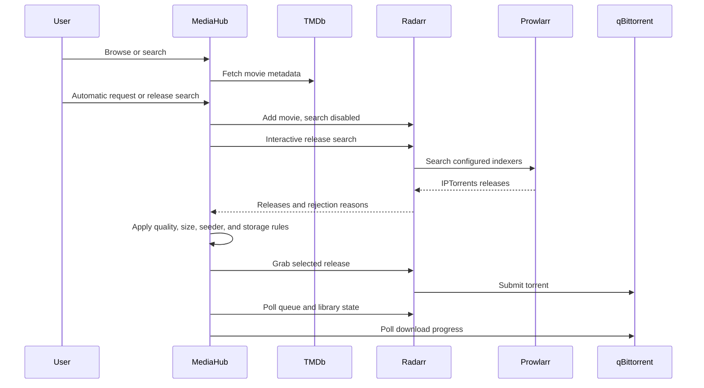

# MediaHub architecture

## Purpose

MediaHub provides a family-friendly Home Assistant Ingress interface for discovering, requesting, and tracking movies and television while keeping automation, download-client credentials, and indexer details hidden from requesters.

## Initial components

1. **Home Assistant add-on packaging**
   - Home Assistant Ingress
   - `/media` and `/share` mappings
   - Add-on options for storage and integrations

2. **FastAPI backend**
   - Request lifecycle API
   - Storage-space validation and reservation accounting
   - Duplicate detection
   - Audit events
   - Setup orchestration and credential-safe public settings

3. **Integration boundary**
   - Typed configuration for TMDb, Prowlarr, Radarr, Sonarr, and qBittorrent
   - Vendor-supported health and system endpoints only
   - Bounded timeouts and sanitised failure responses
   - No direct private-tracker access

4. **Movie discovery and request orchestration**
   - TMDb provides catalogue metadata, posters, search, cast, ratings, and trailers
   - Radarr owns movie records, interactive release search, release grabbing, and import state
   - Prowlarr owns IPTorrents authentication and translates private-indexer results for Radarr
   - qBittorrent provides torrent progress only; MediaHub does not submit tracker downloads directly
   - Browser-visible release data excludes GUIDs, download URLs, info hashes, cookies, and passkeys
   - Short-lived random release tokens are bound to the requesting Home Assistant user

5. **Home Assistant discovery**
   - Authenticated Supervisor API access through `SUPERVISOR_TOKEN`
   - Installed app matching by Supervisor slug and metadata
   - Internal DNS names derived from the full app slug with underscores converted to hyphens
   - Suggested URLs only, with no credential scraping from other apps

6. **Private runtime settings**
   - Home Assistant app options remain the base configuration
   - Wizard settings are stored in `/data/mediahub-settings.json`
   - Atomic replacement and owner-only `0600` permissions
   - Secret values are write-only and never included in setup responses or audit details

7. **SQLite persistence**
   - Requests
   - Append-only audit events
   - Home Assistant-linked users and MediaHub roles
   - Future media cache, recommendations, and integration state

## Authentication and authorization

Home Assistant Ingress is the authentication boundary. MediaHub requires the Supervisor-provided `X-Remote-User-Id` header and uses `X-Remote-User-Name` and `X-Remote-User-Display-Name` to keep the local user profile current. Client-supplied application credentials are not accepted.

MediaHub persists three application roles:

- `admin`: integration setup, audit access, user management, and all request operations
- `manager`: operational status and all household request history
- `requester`: request creation and access to the user's own request history

The first authenticated user becomes the bootstrap administrator. The panel remains Home Assistant-admin-only during this stage, preventing a non-administrator from claiming the bootstrap role. All later users default to `requester`, and the last active MediaHub administrator cannot be demoted.

## Initial request lifecycle

```text
requested
  -> approved automatically
  -> searching
  -> queued
  -> downloading
  -> processing
  -> available
```

Requests may also transition to rejected, failed, cancelled, or deleted.

## Movie request sequence



MediaHub deliberately does not scrape or authenticate to IPTorrents. Private tracker credentials remain in Prowlarr. Radarr release GUIDs may contain tracker-specific data, so MediaHub replaces them with random, user-bound tokens before sending release results to the browser. Tokens expire after 25 minutes and are consumed when selected.

## Storage protection

A request is accepted only when projected free space remains above the protected reserve after accounting for:

- existing active reservations
- estimated download size multiplied by the reservation multiplier
- the configured safety margin
- the permanent minimum-free-space threshold

Default values:

- Minimum free space: 50 GB
- Safety margin: 10 GB
- Reservation multiplier: 1.5

No automatic media deletion is permitted in v0.1.

## Audit model

Every request and administrative action creates an append-only event containing:

- timestamp
- actor ID and display name
- action
- request ID where applicable
- structured JSON details

Credentials and secrets must never be recorded.

## Setup security

The MediaHub panel is restricted to Home Assistant administrators while Milestone 1 setup is being built. Home Assistant Ingress provides authentication, and the setup API is not published through a host port. Runtime configuration responses return only non-sensitive connection fields and booleans indicating whether each secret exists.

Automatic discovery uses read-only Supervisor app metadata. It does not read another app's options and does not communicate directly with any private tracker. Prowlarr remains MediaHub's only indexer boundary.

## Smart recommendations roadmap

Smart recommendations will initially use metadata signals rather than generative AI:

- genres and keywords from previously requested or available titles
- cast and crew overlap
- TMDb recommendation and similarity data
- popularity and rating thresholds
- exclusions for already available, rejected, or disliked titles

Later versions can add per-user weighting, explicit likes/dislikes, household profiles, and explainable recommendation reasons.
